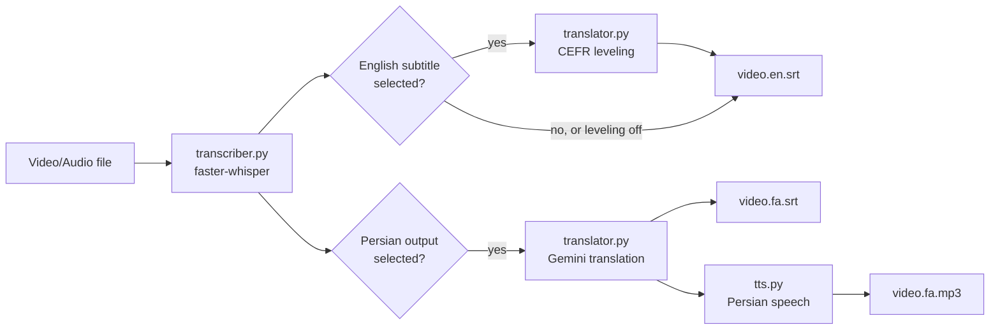

# Pearsian — Persian Subtitle & Voice-Over Studio

A desktop app that takes an English video and produces any combination of:

| Output | File | How it's made |
|---|---|---|
| English subtitles | `video.en.srt` | Speech-to-text with [faster-whisper](https://github.com/SYSTRAN/faster-whisper) |
| Persian subtitles | `video.fa.srt` | Translated with Gemini, with visual highlighting for transliterated terms |
| Persian voice-over | `video.fa.mp3` | Text-to-speech, timed to match the original video |

You pick exactly which outputs you want — generating just the English subtitles skips translation and audio entirely, so no Gemini API key is needed for that alone.

## Why this exists

Whisper is very good at transcribing English speech, and Gemini is very good at translation — but stitching them into something that actually produces watchable Persian subtitles and a listenable Persian voice-over takes a fair amount of glue: keeping line counts in sync, handling API rate limits and outages gracefully, avoiding sentences that get cut mid-way by subtitle timing, and making synthesized speech sound natural instead of robotically stretched to fit a time slot. That glue is what this project is.

## Features

- **Multiple Gemini API keys** — add several keys; if one hits its quota (HTTP 429), the app automatically tries the next.
- **Configurable model priority** — list Gemini models in the order they should be tried (e.g. `gemini-3.6-flash`, then a fallback). When Google deprecates a model, just add the new one — no code changes needed.
- **Selectable outputs** — English subtitles, Persian subtitles, and Persian audio can each be turned on or off independently.
- **English subtitle leveling** — optionally rewrite the English subtitle text to match a CEFR proficiency level (A1–C2), for language learners. This only affects the English subtitle file; the Persian translation is always produced from the original, unmodified transcript.
- **Persian translation style** — choose between:
  - **Literal**: stays close to the English sentence structure while remaining fully natural, grammatical Persian (good for learners mapping English ↔ Persian).
  - **Friendly**: simple, casual, conversational Persian that prioritizes ease of understanding over closeness to the English wording.

  Whichever style you pick is also what the Persian audio is generated from — subtitle and voice-over are always built from the exact same translated text.
- **Term highlighting** — technical/product names (e.g. *Burp Suite*, *Proxy*) are transliterated into Persian script rather than translated, and shown in a distinct color/bold in the subtitle so viewers can tell "this is the English term written in Persian" from an actual translation.
- **Sentence-aware text-to-speech**:
  - Detects when Whisper has split a single sentence across multiple subtitle cues (common when a sentence runs long) and speaks it as one continuous utterance instead of several disjointed fragments.
  - Never artificially slows speech down — natural pace is always preferred. Only speeds up a line, and only as much as needed, when it would otherwise talk over the next line.
  - Speed corrections are based on *measuring* the actually-rendered audio, not on guessing from text length, so pacing stays consistent regardless of punctuation, numbers, or transliterated terms.
  - Two playback layouts: timed to match the video exactly (needs ffmpeg), or spoken back-to-back with punctuation-aware pauses (no ffmpeg required).
- **Resilient by design**: per-stage progress reporting, request timeouts (the Gemini SDK has no default timeout, so a stalled connection can't freeze the app), automatic retry with backoff, and clear Persian-language error messages for the most common failure modes (invalid/region-blocked API key, deprecated model, quota exhaustion, missing ffmpeg, no write permission, etc).
- **HiDPI-aware UI** — crisp rendering on high-DPI displays, with a dark navy theme and full right-to-left layout.

## Prerequisites

- Windows 10/11 (also runs on Linux and macOS)
- [Python 3.10+](https://www.python.org/downloads/) — on Windows, check "Add python.exe to PATH" during install
- One or more free Gemini API keys from [aistudio.google.com](https://aistudio.google.com)
- **Only needed for Persian audio**: [FFmpeg](https://www.gyan.dev/ffmpeg/builds/) on your system PATH (for exact video-timed playback; without it, the app falls back to a sequential audio layout)

## Installation

```bash
git clone <this-repo-url>
cd pearsian
python -m venv venv

# Windows
venv\Scripts\activate
# Linux/macOS
source venv/bin/activate

pip install -r requirements.txt
python app.py
```

If you don't need the Persian audio output, you can skip the last two lines of `requirements.txt` (`edge-tts`, `pydub`) — the app runs fine without them and simply disables that option.

## Quick start

1. Add at least one Gemini API key (only required if you want Persian subtitles or audio).
2. Pick a video or audio file.
3. Check the outputs you want: English subtitles, Persian subtitles, Persian audio — any combination.
4. Adjust settings for whichever outputs you selected (they only appear when relevant — e.g. the Persian audio settings are hidden unless that output is checked).
5. Click **Start Processing** and watch the per-stage progress bars.
6. Output files are written next to your input file.

## Configuration notes

**Multiple API keys** — click "Add new key". Keys are tried in order within a model, and if every key is exhausted for one model, the app moves to the next model in your priority list.

**Model priority** — reorder with ▲/▼, or type in any model name manually. This is a plain text field on purpose: when Google renames or retires a model, you don't need a code update, just type the new name here.

**English subtitle level** — set to "Original" to keep Whisper's raw transcript untouched (default), or pick a CEFR level (A1 through C2) to have Gemini rewrite the English text for that proficiency level. C2 is treated the same as "Original" (no simplification needed at native-like proficiency), which also saves an API call.

**Persian translation style** — "Literal" and "Friendly" (see Features above). This is a single setting that drives both the Persian subtitle wording and the Persian audio script.

**Term highlighting** — controlled from the Persian subtitle card: color only, bold only, both, or no distinction at all. Color/bold tags render correctly in VLC, MPV, and PotPlayer; if your player shows the raw tags as text instead of styling, switch to "No distinction."

**Persian audio** — choose a voice, a base speaking rate, and a layout mode:
- *Timed to video*: each sentence plays at its real timestamp (requires ffmpeg).
- *Sequential*: sentences play back-to-back with natural pauses; no ffmpeg needed, but audio will drift out of sync with the video over a long file.

## Project structure

```
pearsian/
├── app.py                # Tkinter GUI
├── src/
│   ├── config.py         # Local persistence for keys and settings (config.json)
│   ├── transcriber.py    # Speech-to-text via faster-whisper
│   ├── translator.py     # Gemini translation, CEFR leveling, term highlighting
│   ├── tts.py             # Persian text-to-speech (optional)
│   └── pipeline.py       # Wires the stages together, output selection, progress
├── requirements.txt
└── README.md
```

## How it fits together



The English subtitle leveling step and the Persian translation step both read from the *original* Whisper transcript — they never feed into each other.

## Troubleshooting

| Symptom | Likely cause / fix |
|---|---|
| HTTP 429 / quota exhausted | Add another API key, or wait a few minutes — Gemini's free tier has a requests-per-minute cap. |
| "Model not available" | Google has retired that model version; type a current model name into the model priority list. |
| Invalid key / no access | If the key is correct, Gemini may not be available in your region — try a VPN. |
| Whisper model download hangs | huggingface.co may be blocked from your network; run once over a VPN, then the model is cached locally. |
| `cublas64_12.dll not found` | You selected `cuda` as the processing device without a working CUDA/cuBLAS install. Switch the device to `cpu`. |
| Garbled/reversed Persian text in the log window | This is a Tkinter rendering limitation, not a data problem — the actual subtitle/audio output is correct. Install `python-bidi` (already in requirements) to fix log display. |
| No sound from Persian audio, or option greyed out | Install the optional TTS dependencies: `pip install edge-tts pydub`. |
| Persian audio out of sync with video | Make sure ffmpeg is installed and on PATH, and that "Timed to video" is selected. |

## Security note

`config.json` stores your API keys in plain text and is excluded via `.gitignore`. Do not commit it or share it publicly. If a key is ever exposed accidentally, revoke it at [aistudio.google.com](https://aistudio.google.com) and generate a new one.

## License

Add a license of your choice here (e.g. MIT) before publishing, if you intend this to be open source.
